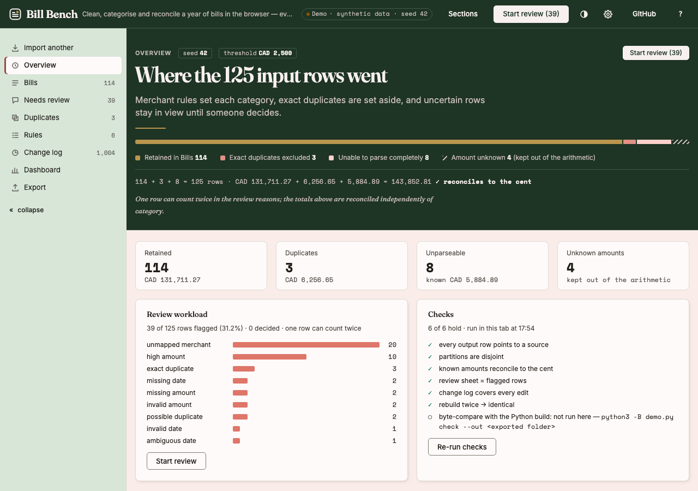
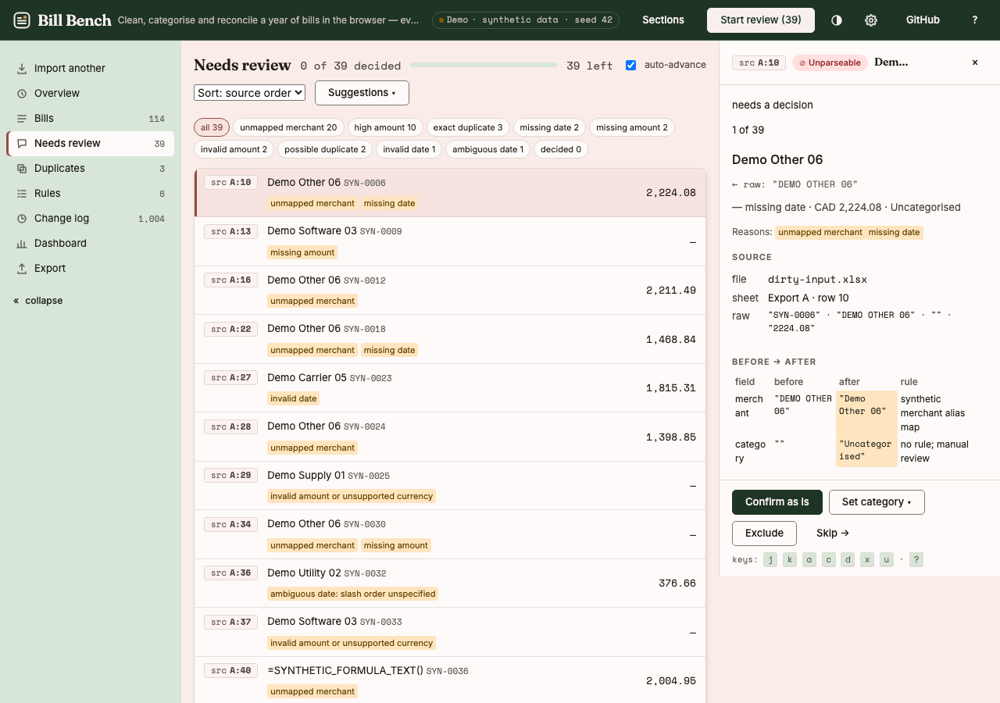
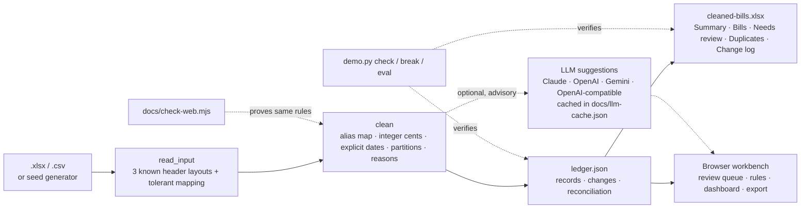

# Bill Bench

**Clean, categorise and reconcile a year of bills in the browser — every row stays traceable.**

Three inconsistent Excel exports go in; a five-sheet month-end review workbook comes out. Rules normalise merchants, dates and amounts, exact duplicates are separated, uncertain rows are flagged for a person instead of guessed, and the totals reconcile to the cent. The same rules run as a Python CLI and as a browser app, and a checker proves the two agree.

> This is a runnable demonstration with **synthetic data** (125 generated rows, seed 42). It is not a client case study, and no bill ever leaves your machine.

[](https://github.com/NickkkLian/bill-categoriser/actions/workflows/check.yml)



## Try it

**In the browser** — open the [live demo](https://nickkklian.github.io/bill-categoriser/?demo=1) (GitHub Pages, static, no server), or open `docs/index.html` from a clone; it works offline. *Load the sample workbook* generates the 125 synthetic rows in the tab, or drop your own `.xlsx` / `.csv` onto the landing page: files are parsed locally and never uploaded.

**From the command line** — tested on macOS 15.7 with Python 3.9, 3.12 and 3.13. No packages, accounts or network access are needed.

```sh
python3 -B demo.py check
python3 -B demo.py build
python3 -B demo.py check
```

`build` writes `output/dirty-input.xlsx`, `output/ledger.json` and `output/cleaned-bills.xlsx`; `check` verifies them (the delivered files are already built, so you can open [the workbook](output/cleaned-bills.xlsx) first). On Windows use `python` if that is your Python command.

| Seed 42 result | Rows | Known amount (CAD) |
| --- | ---: | ---: |
| Retained in Bills | 114 | 131,711.27 |
| Exact duplicates excluded | 3 | 6,256.65 |
| Unable to parse completely | 8 | 5,884.89 |
| All input rows | 125 | 143,852.81 |

Four input amounts are unknown; they are kept out of the arithmetic, never treated as zero. `131,711.27 + 6,256.65 + 5,884.89 = 143,852.81` is asserted by `check`, by the browser's own checks card, and by the workbook's reconciliation formula.

## What the browser version adds



- **Overview** — a reconciliation panel that shows where every input row went, four partition cards, the review workload by reason, and six checks that run in the tab.
- **Bills / Change log** — both tables sort by their column headers and filter from one row above them; **Duplicates** shows each excluded or possible duplicate next to the row it repeats. Every value carries a provenance chip (`src A:6`) that links back to the source sheet and row; 1,004 build-time changes plus your own decisions are logged with the rule that caused them.
- **Needs review** — a keyboard-driven queue (`j`/`k`, `a` confirm, `c` category, `d` duplicate, `x` exclude, `u` undo). Every decision is undoable and written to the change log; "also add rule" turns one decision into a rule and shows how many rows it affects first.
- **Rules** — alias → category rules and the high-amount threshold; edits show their impact (rows re-categorised, flagged, un-flagged) before you apply them.
- **Suggestions** for unmapped merchants: *Simulate* (canned keyword rules, no network, labelled simulated), *cached model output* shipped in the repo (model and date shown), or *your own model* — Claude, OpenAI, Google Gemini or any OpenAI-compatible endpoint such as Ollama (the key is kept in the tab's memory, never stored). Suggestions only ever enter the review queue; accepting one is recorded as your decision.
- **Export** — the same five-sheet workbook, `ledger.json` and `rules.json`, built in the browser with the same OOXML writer the CLI uses. A zero-decision export of the sample is byte-identical to the CLI's `ledger.json`, and `demo.py check` accepts a browser-built folder.
- Settings for three palettes (Plaster, Paper, Ink) with light and dark, a 375 px layout, URL state for every view, IndexedDB persistence, and a "Clear all data" button.

## How it fits together



`demo.py` and `docs/bills-engine.js` are two implementations of the same rules. `docs/check-web.mjs` proves they agree: the Python-compatible random stream (six seeds × 2,000 draws), the generated rows, the ledger bytes for three seeds, every cell and formula of the five sheets, XLSX reading (stored and deflate-compressed members), and finally `python3 -B demo.py check` accepting a folder the JavaScript engine built — with a negative control that removes one row and must be rejected. It runs in CI on every push.

## Rules and trade-offs

1. `generate(seed)` creates 120 base records, three exact copies and two possible duplicates across three sheets, with mixed headers, date formats, merchant aliases, currency symbols, thousands separators, refunds, zero, missing fields and malformed fields.
2. Amounts are integer cents. Supported amounts are CAD; dates accept only explicit year-first formats or a named month. `03/04/2025` is rejected because the source does not define a day/month order.
3. Merchant classification is an exact alias map. Unknown merchants become `Uncategorised` and require review. The optional LLM step never changes that: it produces suggestions, and a person accepts or dismisses each one.
4. An exact duplicate needs invoice ID, normalised merchant, date and cents to match. A different invoice ID with the same merchant, date and cents is retained and flagged as a possible duplicate. Fuzzy matching is deliberately not attempted.
5. A source row belongs to exactly one of `clean`, `duplicate` or `unparseable`. `clean` means structurally parseable, not approved for posting. Missing dates still contribute their known amounts to the control total. In the browser, a reviewer can additionally mark a row `excluded`; the export then adds an "Excluded by reviewer" line so the control total still reconciles.
6. Formula-like merchant text is stored as a literal string and never becomes an executable Excel formula. Input cells containing actual formulas are rejected.
7. The workbook is produced by filling bundled, pre-formatted XLSX templates with a small standard-library OOXML reader/writer; the writer uses stored ZIP members and fixed metadata so rebuilds are byte-for-byte identical.

### Review workload in this sample

Seed 42 with the default threshold flags **39 of 125 rows (31.2%)**: 20 unmapped merchants, 10 high amounts, 3 exact duplicates, 2 possible duplicates, 2 missing dates, 2 missing amounts, 2 invalid amounts, 1 invalid date and 1 ambiguous date (a row can carry more than one reason). The sample deliberately spreads amounts across CAD 12 to 2,800 with explicit edge cases; it is a stress sample, not a measured bill distribution. Change the high-amount threshold with `--high-cad AMOUNT` at build time (and pass the same value to `check`); the browser has the same control on the Rules page.

## Checks, a deliberately broken workbook, and the evaluation set

```sh
python3 -B demo.py check
python3 -B demo.py break
python3 -B demo.py eval
```

`check` verifies source identities, disjoint partitions, known amounts, every output cell and formula, review and change-log contents, parsing boundaries, repeatability (two rebuilds must match the delivered files byte for byte) and, new in this version, that the LLM cache is well-formed and that any suggestions file is purely advisory.

`break` runs three mutations in disposable copies and requires the real checker to reject each: a deleted Bills row, a changed threshold default that produces 92 review rows instead of 39, and a cache entry with a category outside the allowed set. It exits 0 only after observing all three failures; your delivered files stay intact.

`eval` scores the optional LLM categoriser on `eval/merchants.json`: 30 synthetic merchant names, 20 that carry an obvious keyword and 10 that need inference. It prints the keyword baseline (19/30 by construction) next to the cached model output and passes at 80% accuracy. Until a maintainer has run `ANTHROPIC_API_KEY=... python3 -B demo.py eval --llm` once, it reports **NOT RUN** (exit code 2) rather than a made-up number. This is a small evaluation set, not a formal evaluation pipeline.

For another synthetic dataset:

```sh
python3 -B demo.py build --seed 17 --out output-seed-17
python3 -B demo.py check --out output-seed-17
```

To use a different high-amount threshold, keep the build and check arguments together:

```sh
python3 -B demo.py build --high-cad 2000 --out output-high-2000
python3 -B demo.py check --high-cad 2000 --out output-high-2000
```

The web engine's parity check needs Node 22 (for `DecompressionStream('deflate-raw')`) and Python:

```sh
node docs/check-web.mjs
```

### The optional LLM step

`python3 -B demo.py build --llm` asks a model about each `Uncategorised` merchant and writes `output/llm-suggestions.json` with `category / confidence / reason`; answers are cached in `docs/llm-cache.json` with the provider, model and date, keyed by normalised merchant name, so later builds and the browser page work offline. The ledger and workbook never change: the step is advisory by design, and `check` asserts that. Any failure — no key, no model id, timeout, malformed reply, a category outside the allowed set — falls back to `Uncategorised` without stopping the build.

The model is your choice. Claude is the default, not a requirement:

```sh
ANTHROPIC_API_KEY=... python3 -B demo.py build --llm                                    # Claude, claude-sonnet-5
LLM_PROVIDER=openai OPENAI_API_KEY=... LLM_MODEL=<model id> python3 -B demo.py build --llm
LLM_PROVIDER=gemini GEMINI_API_KEY=... LLM_MODEL=<model id> python3 -B demo.py build --llm
LLM_PROVIDER=openai-compatible LLM_BASE_URL=http://localhost:11434/v1 LLM_MODEL=<model> python3 -B demo.py build --llm   # Ollama, LM Studio, vLLM…
```

Only Claude has a default model id; for the others you name one from your provider's list, so nothing here goes stale when a vendor renames its models. `llm.py` (CLI) and `docs/llm.js` (browser) are the same small adapter in two languages, with no SDKs. They use nothing provider-specific as a precondition — no tool calling, JSON mode or response schemas. The prompt asks for a JSON array in plain words, and the parser keeps only well-formed entries whose category is in the allowed set, so a model that ignores the instruction produces no suggestions rather than wrong ones. Keys are sent in headers only, never in a URL, and never written to disk or browser storage.

| Provider | How to select it | What has been run |
|---|---|---|
| Claude (Anthropic) | default · `ANTHROPIC_API_KEY` | Request and reply format checked against a local mock of the documented API, from the CLI and from the page in a Chromium browser. **Not yet run against the live API** — `docs/llm-cache.json` does not exist until a maintainer runs it with a key. |
| OpenAI | `LLM_PROVIDER=openai` · `OPENAI_API_KEY` · `LLM_MODEL` | Format checked against a local mock (sends `max_completion_tokens`, no `temperature`). Should work per OpenAI's documentation; **not run against the live API.** |
| Google Gemini | `LLM_PROVIDER=gemini` · `GEMINI_API_KEY` · `LLM_MODEL` | Format checked against a local mock, from the CLI and from the page in a Chromium browser (key in the `x-goog-api-key` header). Should work per Google's documentation; **not run against the live API.** |
| OpenAI-compatible | `LLM_PROVIDER=openai-compatible` · `LLM_BASE_URL` · `LLM_MODEL` · optional `LLM_API_KEY` | End to end in a Chromium browser against a local CORS-enabled mock endpoint: 20 of 20 rows got suggestions. **Not run against a real Ollama, LM Studio or vLLM server.** A server called from the page must allow its origin (Ollama: `OLLAMA_ORIGINS`). |

```sh
python3 -m unittest discover -s tests -v     # adapter against a mock of each provider; demo.py build --llm end to end per provider
node docs/check-llm.mjs                       # the browser adapter, same contract
```

## Supported layouts

The CLI reader and the browser's strict mode accept the demo layout only: three sheets named `Export A / B / C` whose fourth row holds one of the three known header sets (`Invoice / Vendor / Date / Amount`, `Bill ID / Merchant name / Invoice date / Total CAD`, `Reference / Payee / Billed on / Gross amount`). For your own files the browser also tries a tolerant mapping: it looks in the first five rows of each sheet for headers containing words like *invoice*, *merchant*/*vendor*/*payee*, *date* and *amount*/*total*, reports which columns it matched, and rejects a sheet it cannot map with the headers it found. Text dates and text or numeric amounts are read; Excel serial dates, PDFs, macros and non-CAD amounts are not.

## Where this is not suitable

This is not a general Excel migration tool and not an accounting system. It does not support arbitrary workbooks beyond the header mapping above, OCR/PDF invoices, macros, tax treatment, exchange-rate conversion or posting to accounting software. Review the workbook before using a result in another system.

**Not verified here:** native Windows and Linux runs of the checker (only macOS was run locally; CI covers Ubuntu, Windows and macOS on Python 3.9 and 3.13 — see the Actions tab); browser exports that include reviewer decisions or rules cannot be checked by `demo.py check`, only zero-decision exports can; the LLM step and the evaluation set have not been run until `docs/llm-cache.json` exists; the tolerant header mapping was tested on synthetic files only; the checker shares some rules with the producer, so independent review remains useful.

## Repository layout

```
demo.py                 CLI: build / check / break / eval (Python 3.9+, standard library only)
xlsx_io.py              minimal OOXML reader and template filler
templates/              pre-formatted input and output workbook templates
output/                 delivered artefacts for seed 42 (input, ledger, workbook)
eval/merchants.json     30 synthetic merchants → expected category
docs/index.html         the browser app (GitHub Pages root)
docs/bills-engine.js    the rules, ported one for one from demo.py
docs/check-web.mjs      Node harness proving the port equals the CLI
docs/templates.js       the two templates as base64, so the page works offline
docs/design-tokens.css  shared design tokens (light and dark)
```

MIT licensed. Copyright 2026 Nick Lian.
